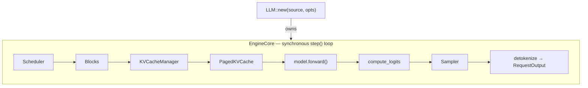

# vllm-oxide

**English** | [简体中文](README.zh-CN.md)

[![CI][ci-badge]][ci-url]
[![License: Apache-2.0][license-badge]][license-url]

[ci-badge]: https://github.com/RedHeartSecretMan/vllm-oxide/actions/workflows/ci.yml/badge.svg
[ci-url]: https://github.com/RedHeartSecretMan/vllm-oxide/actions/workflows/ci.yml
[license-badge]: https://img.shields.io/badge/license-Apache--2.0-blue.svg
[license-url]: LICENSE

A Rust port of [nano-vllm](https://github.com/GeeeekExplorer/nano-vllm) trending toward vLLM's V1 architecture, with a correctness-first v0.2.0 contract.

- **Single-GPU, offline inference** — no server, no async. Continuous batching, prefix caching, paged KV cache, and recompute-only preemption in a synchronous engine.
- **Qwen3 generation contract** — the supported library boundary is synchronous `LLM::generate` on one CUDA GPU; model registration and execution mechanics remain internal.
- **Two-tier correctness** — CI property tests catch regressions fast; a GPU release gate with golden fixtures validates numerical output against a transformers oracle.

[Architecture](#architecture-overview) | [Quick Start](#quick-start) | [Testing](#testing) | [Contributing](#contributing)

## Table of Contents

- [What is this?](#what-is-this)
- [Architecture overview](#architecture-overview)
- [Requirements](#requirements)
- [Quick Start](#quick-start)
- [Library usage](#library-usage)
- [Build features](#build-features)
- [Testing](#testing)
- [Documentation](#documentation)
- [Contributing](#contributing)
- [Minimum Supported Rust Version (MSRV)](#minimum-supported-rust-version-msrv)
- [Security](#security)
- [License](#license)

---

## What is this?

vllm-oxide brings LLM inference to the Rust ecosystem. Built on [candle](https://github.com/huggingface/candle) (CUDA kernels, safe tensor ops) and flash-attention (paged attention kernels), it provides a synchronous, in-process engine with:

- Continuous batching and prefix caching
- Paged KV cache (`block_size = 256`)
- Recompute-only preemption

v0.2.0 supports **single-GPU Qwen3 offline generation**: one in-process, synchronous `LLM::generate` interface with no server or async runtime. Other model families, serving APIs, TP/NCCL, CUDA Graphs, quantization, LoRA, and speculative decoding are outside this release boundary.

### Project goals

- A drop-in replacement for Python inference engines in production — correct first, then fast.
- Architecture decisions recorded as ADRs (`docs/adr/`), domain vocabulary documented in `CONTEXT.md`.

## Architecture overview



The engine runs a synchronous `step()` loop: schedule tokens, prepare tensors, run the model forward pass (hidden states), compute logits from the last-token hidden state, sample the next token, update the KV cache, and repeat until all sequences finish.

Key design decisions (see `CONTEXT.md` for the full vocabulary):

- **Paged attention**: K/V cache stored in fixed-size blocks (`block_size = 256`). Prefill uses unpaged `flash_attn_varlen`; decode uses paged `flash_attn_varlen_paged_windowed`.
- **Prefix caching**: Chained XXH64 hash table in `BlockPool` deduplicates common prompt prefixes across requests (CoW semantics).
- **TP seam**: The internal `ParallelStyle` trait + `TpConfig` enum preserve a future feasibility seam. v0.2.0 supports `TpConfig::Single` only; TP/NCCL is not a runtime capability.
- **CausalLM trait**: An internal engine-facing model contract. The inventory registry, loader, scheduler, cache, attention metadata, and sampler are implementation details behind `LLM`.

## Requirements

### Hardware

- **CPU-only** (tests, development): any x86-64 or aarch64 machine. No GPU needed.
- **Inference / release gate** (with `--features cuda`):
  - NVIDIA GPU with compute capability **sm_89** or higher (Ada Lovelace RTX 40-series, Hopper H100/H200, or newer).
  - At least 8 GB of GPU memory recommended for Qwen3-0.6B.
  - CUDA driver installed (tested with CUDA 12.x and 13.2).

### Toolchain

- **Rust**: edition 2021, rust-version 1.75+ (as declared in [workspace.package]).
- **System**: Linux (the only supported NVIDIA CUDA platform). Windows and macOS GPU inference are outside v0.2.0.

## Quick Start

### Build

```bash
# CPU-only build (tests, development iteration)
cargo build

# Production build with CUDA backend
cargo build --features cuda --release
```

### Run the CLI

The thin CLI (`crates/vllm-oxide-cli`) accepts a model source and an optional prompt:

```bash
cargo run --release -p vllm_oxide_cli --features cuda -- \
    --model Qwen/Qwen3-0.6B \
    "The meaning of life is"
```

If no prompt is given on the command line, the CLI reads from stdin:

```bash
echo "The meaning of life is" | \
    cargo run --release -p vllm_oxide_cli --features cuda -- \
        --model Qwen/Qwen3-0.6B
```

#### CLI flags

| Flag | Description | Default |
|------|-------------|---------|
| `-m`, `--model` | Local checkpoint directory _or_ HuggingFace Hub repo id (e.g. `Qwen/Qwen3-0.6B`). Existing directories resolve to local checkpoints; everything else resolves to the Hub. | (required) |
| `prompt` (positional) | Prompt text. Reads from stdin when not provided. | stdin |
| `--temperature` | Sampling temperature. `0` = greedy (deterministic). | `0` |
| `--top-k` | Top-k sampling: keep only the `k` highest-logit tokens. | `None` (disabled) |
| `--top-p` | Top-p (nucleus) sampling: keep smallest token set with cumulative probability >= `p`. | `None` (disabled) |
| `--max-tokens` | Maximum tokens to generate. | `16` |

### Running the library example

```bash
# Construct LLM and generate through the supported public interface
cargo run --release --example generate_qwen3 --features cuda -- hub:Qwen/Qwen3-0.6B
```

The examples accept `hub:<repo>` and `hub:<repo>@<revision>` URLs, or a local directory path.

## Library usage

Add `vllm_oxide` as a dependency in your `Cargo.toml`:

```toml
[dependencies]
vllm_oxide = { git = "https://github.com/RedHeartSecretMan/vllm-oxide.git", features = ["cuda"] }
anyhow = "1"
```

The complete supported crate-root surface is `LLM`, `EngineOptions`, `Prompt`, `SamplingParams`, `RequestOutput`, and `Source`. `LLM::new` constructs the composition root and `LLM::generate` accepts batched prompts with one sampling policy per prompt:

```rust
use vllm_oxide::{LLM, Prompt, SamplingParams, EngineOptions, Source};

fn main() -> anyhow::Result<()> {
    // Build the engine from a HuggingFace Hub repo.
    let mut llm = LLM::new(
        Source::Hub {
            repo: "Qwen/Qwen3-0.6B".into(),
            revision: None,
        },
        EngineOptions::default(),
    )?;

    // Run inference on a batch of prompts.
    let outputs = llm.generate(
        &[
            Prompt::Text("The meaning of life is".into()),
            Prompt::Text("Once upon a time".into()),
        ],
        &[
            SamplingParams {
                max_tokens: 64,
                temperature: 0.7,
                ..Default::default()
            },
            SamplingParams {
                max_tokens: 32,
                temperature: 0.0, // greedy
                ..Default::default()
            },
        ],
    )?;

    for output in outputs {
        println!(
            "[{}] {} (finished: {})",
            output.request_id, output.text, output.finished
        );
    }

    Ok(())
}
```

### Key types

| Type | Description |
|------|-------------|
| `LLM` | Composition root. Constructed via `LLM::new(source, options)`, invoked via `LLM::generate(prompts, params)`. |
| `Prompt` | Input enum: `Text(String)` for natural-language prompts, `TokenIds(Vec<u32>)` for pre-tokenized fixtures. Both are accepted in the same batch. |
| `SamplingParams` | Per-prompt configuration: `temperature`, `top_k`, `top_p`, `max_tokens`, `ignore_eos`, `presence_penalty`, `frequency_penalty`, `repetition_penalty`. Default is greedy (temperature=0). |
| `RequestOutput` | Per-request result: `{ request_id, token_ids, text, finished }`. The result vector preserves input-prompt order; request identity does not expose the internal sequence identifier. Both decoded text and raw token IDs are always provided. |
| `EngineOptions` | Construction-time config: `max_num_batched_tokens` (default 16384), `max_num_seqs` (512), `max_model_len`, `gpu_memory_utilization` (0.9), eager execution (CUDA Graphs are out of v0.2.0 scope), and a `dtype` override. |
| `Source` | Weight source: `Source::Local(PathBuf)` for a local directory, or `Source::Hub { repo, revision }` for HuggingFace Hub. |

`LLM::new` and `LLM::generate` return `anyhow::Result`; `anyhow::Error` is a transitive signature type rather than a vllm-oxide root export. Likewise, `EngineOptions::dtype` uses `Option<candle_core::DType>` without re-exporting `DType`.

### Sampling parameter semantics

| Field | Supported v0.2.0 semantics |
|-------|----------------------------|
| `temperature` | Not NaN and `>= 0`; `0` selects greedy, while positive infinity remains the uniform pre-filter corner case. |
| `top_k` | `None` or `Some(k)` with `k >= 1`; values at least the vocabulary size are a no-op. |
| `top_p` | `None` or a finite value in `(0, 1]`; `1` is a no-op. |
| `max_tokens` | At least `1`; counts completion tokens only. |
| `ignore_eos` | Ignores model-resolved EOS stopping when true, but never bypasses `max_tokens`. |
| `presence_penalty`, `frequency_penalty` | Finite values in `[-2, 2]`. |
| `repetition_penalty` | Finite and `>= 0`; `0` is the accepted no-op convention. |

Every combination of individually valid fields is supported. Penalties run before selection; `temperature == 0` or `top_k == Some(1)` selects the greedy path, making later top-k/top-p filtering inert.

## Build features

vllm-oxide uses a `cuda` feature gate to separate CPU-only development from GPU inference:

```toml
[features]
default = []        # CPU-only — tests and dev iteration run without CUDA.
cuda = ["dep:candle-flash-attn", "candle-core/cuda"]  # Production backend.
```

Default is CPU-only so `cargo test` runs on CI without a GPU. Production callers (the CLI, the engine) pass `--features cuda`.

The workspace release harness additionally enables default-off `internal-golden`. It adds no public Rust item and is unsupported diagnostic tooling: only an explicitly configured release-gate call captures full logits into a private, fail-closed temporary artifact. Enabling the feature alone performs no diagnostic I/O.

## Testing

vllm-oxide has two distinct test tiers with different guarantees:

### Tier 1: CI gate (every push, CPU-only)

```bash
# Unit tests, property tests — no GPU required
cargo test
```

Covers `EngineOptions` defaults, `Prompt` variants, `SamplingParams` validation, config parsing, `Source` classification, and CLI argument parsing.

### Tier 2: Release gate (manual, GPU)

The release gate validates the Rust engine's numerical output against golden fixtures. It requires one sm_89 GPU, the pinned model snapshot, and the reviewed ADR-0012 environment. Run it through the independently resumable stages; `publish` remains separately authorized.

```bash
# Start a fresh evidence run; invoke later stages one at a time.
./tools/validate-release.sh env \
    /tmp/vllm-oxide-dag-v0.2.0/t45-artifacts/<run-id> \
    /path/to/Qwen3-0.6B
```

**What it checks:**

| Layer | What | How |
|-------|------|-----|
| **L1** | Greedy token-sequence reference match | Accepts the reference token or an explicit near-tie classification from the same-prefix expected/actual candidate logits under the versioned Tolerance policy. |
| **L2** | Same-prefix logits tensor comparison | Compares raw pre-sampling logits under the versioned absolute tolerance through the first divergent token, then excludes every later row because its causal prefix differs. |
| **L3** | Per-layer activations (debug) | Skeleton in v0.2.0; not a release comparison. |

Golden fixtures are produced by `tools/golden-gen/` (Python), which runs two oracle engines:

- **Reference oracle**: Transformers 4.57.6 / PyTorch 2.10 BF16,
  `output_logits=True`, mandatory SDPA math backend
- **Baseline oracle**: vLLM 0.18.1 BF16, eager FlashAttention-2, calibration
  evidence only

The extended schema-v4 manifest records exact model/tokenizer hashes, runtime and
wheel identities, all three kernel paths, `v0.2.0` / `goldens-v0.2`
compatibility, archive identity, and the versioned Tolerance policy separately
from baseline calibration observations. Baseline evidence cannot override a
reference-oracle failure. The first four-case candidate observation is always
non-accepting; only a reviewed Definition checkpoint can authorize holdout access.

The `goldens-v0.2` GitHub Release has exactly two assets: `manifest.json` and
`goldens-v0.2.tar.gz`. Fixtures appear only inside that checksum-verified archive,
never as individual assets or in git. See [ADR-0005](docs/adr/0005-golden-generation-correctness-strategy.md)
and [ADR-0010](docs/adr/0010-golden-release-asset-contract.md), plus the
calibration/performance protocol in [ADR-0012](docs/adr/0012-goldens-v0.2-calibration-and-performance-protocol.md).

### CI green vs numerically validated

| | CI gate | Release gate |
|---|---|---|
| **When** | Every push | Manual, before tagging |
| **Where** | CPU-only | GPU (sm_89+) |
| **What** | Property tests | Golden comparison vs transformers oracle |
| **Proves** | Compiles + types correct | Numerically correct within tolerance |

## Documentation

- **[CONTEXT.md](CONTEXT.md)** — Domain vocabulary and ubiquitous language. Every term used in the codebase (`CausalLM`, `BlockPool`, `PagedKVCache`, `EngineCore`, `Prompt`, `SamplingParams`, etc.) is defined here with "Avoid" notes for synonyms that should not be used.
- **[docs/adr/](docs/adr/)** — Architecture Decision Records, including the correctness-first v0.2.0 scope and [ADR-0011](docs/adr/0011-public-generation-contract.md), which records the breaking public-interface contraction.
- **Crate source** — Each module carries a doc comment that explains its role and the ADR-0004 dependency DAG. The `lib.rs` doc comment is the best starting point.

## Contributing

Contributions are welcome! Please read [CONTRIBUTING.md](CONTRIBUTING.md) for branch conventions, commit format, and the CI pipeline before opening a pull request.

## Minimum Supported Rust Version (MSRV)

The current MSRV is **1.75** (declared in `[workspace.package]`). We follow a rolling policy: the MSRV may increase in a minor release, but only to a Rust version that has been stable for at least 6 months.

## Security

To report a security vulnerability, please use [GitHub Security Advisories](https://github.com/RedHeartSecretMan/vllm-oxide/security/advisories/new). Do **not** open a public issue for security reports.

## License

Apache-2.0. See [LICENSE](LICENSE) for details.
