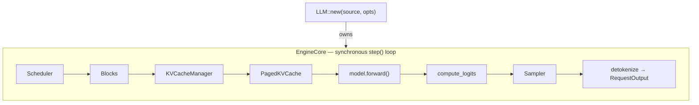

# vllm-oxide

[English](README.md) | **简体中文**

[CI][ci-url]
[License: Apache-2.0][license-url]

[ci-badge]: https://github.com/RedHeartSecretMan/vllm-oxide/actions/workflows/ci.yml/badge.svg
[ci-url]: https://github.com/RedHeartSecretMan/vllm-oxide/actions/workflows/ci.yml
[license-badge]: https://img.shields.io/badge/license-Apache--2.0-blue.svg
[license-url]: LICENSE
[nano-vllm](https://github.com/GeeeekExplorer/nano-vllm) 的 Rust 移植版，逐步靠近 vLLM 的 V1 架构，并采用 correctness-first 的 v0.2.0 合同。

- **单 GPU 离线推理**——无服务器，无异步。同步引擎中的持续批处理、前缀缓存、分页 KV 缓存和仅重计算的抢占策略。
- **Qwen3 生成合同**——支持的库边界是在单张 CUDA GPU 上同步调用 `LLM::generate`；模型注册和执行机制均保持内部实现。
- **双层正确性保证**——CI 属性测试快速捕获回归；GPU 发布门禁通过黄金夹具验证数值输出，以 transformers 为预言机。

[架构概览](#架构概览) | [快速开始](#快速开始) | [测试](#测试) | [贡献指南](#贡献指南)

## 目录

- [这是什么？](#这是什么)
- [架构概览](#架构概览)
- [环境要求](#环境要求)
- [快速开始](#快速开始)
- [库使用方式](#库使用方式)
- [构建特性](#构建特性)
- [测试](#测试)
- [文档](#文档)
- [贡献指南](#贡献指南)
- [最低支持的 Rust 版本 (MSRV)](#最低支持的-rust-版本-msrv)
- [安全](#安全)
- [许可证](#许可证)

---

## 这是什么？

vllm-oxide 将 LLM 推理带入 Rust 生态。它构建在 [candle](https://github.com/huggingface/candle)（CUDA 内核、安全张量操作）和 flash-attention（分页注意力内核）之上，提供一个同步、进程内的推理引擎，支持：

- 持续批处理与前缀缓存
- 分页 KV 缓存（`block_size = 256`）
- 仅重计算（recompute-only）抢占策略

v0.2.0 支持**单 GPU Qwen3 离线生成**：只提供进程内、同步的 `LLM::generate` 接口，不包含服务器或异步运行时。其他模型家族、服务 API、TP/NCCL、CUDA Graphs、量化、LoRA 和 speculative decoding 均不在本版本边界内。

### 项目目标

- 生产级 Python 推理引擎的直接替代——先求正确，再求性能。
- 架构决策以 ADR 形式记录（`docs/adr/`），领域词汇表记录在 `CONTEXT.md` 中。

## 架构概览



引擎运行一个同步的 `step()` 循环：调度 token、准备张量、执行模型前向传播（hidden states）、从最后一个 token 的 hidden state 计算 logits、采样下一个 token、更新 KV 缓存，然后重复直到所有序列完成。

关键设计决策（完整词汇表见 `CONTEXT.md`）：

- **分页注意力（Paged attention）**：K/V 缓存存储在固定大小的块（`block_size = 256`）中。预填充阶段使用非分页的 `flash_attn_varlen`；解码阶段使用分页的 `flash_attn_varlen_paged_windowed`。
- **前缀缓存（Prefix caching）**：`BlockPool` 中的链式 XXH64 哈希表对跨请求的公共提示前缀进行去重（写时复制语义）。
- **TP 接缝（TP seam）**：内部 `ParallelStyle` trait 和 `TpConfig` 枚举保留未来可行性接缝。v0.2.0 仅支持 `TpConfig::Single`，TP/NCCL 不是运行时能力。
- **CausalLM trait**：内部的引擎面向模型合同。inventory 注册表、loader、scheduler、cache、attention metadata 和 sampler 都隐藏在 `LLM` 后面。

## 环境要求

### 硬件

- **仅 CPU**（测试、开发）：任意 x86-64 或 aarch64 机器，无需 GPU。
- **推理 / 发布门禁**（启用 `--features cuda`）：
  - NVIDIA GPU，计算能力 **sm_89** 及以上（Ada Lovelace RTX 40 系列、Hopper H100/H200 或更新型号）。
  - 建议至少 8 GB GPU 内存用于 Qwen3-0.6B。
  - 安装 CUDA 驱动（已在 CUDA 12.x 和 13.2 上测试）。

### 工具链

- **Rust**：edition 2021，rust-version 1.75+（见 [workspace.package] 声明）。
- **系统**：Linux（唯一支持的 NVIDIA CUDA 平台）。Windows 和 macOS GPU 推理不在 v0.2.0 范围内。

## 快速开始

### 构建

```bash
# 仅 CPU 构建（测试、开发迭代）
cargo build

# 启用 CUDA 后端的生产构建
cargo build --features cuda --release
```

### 运行 CLI

精简 CLI（`crates/vllm-oxide-cli`）接受模型来源和可选提示：

```bash
cargo run --release -p vllm_oxide_cli --features cuda -- \
    --model Qwen/Qwen3-0.6B \
    "The meaning of life is"
```

如果命令行未提供提示，CLI 会从标准输入读取：

```bash
echo "The meaning of life is" | \
    cargo run --release -p vllm_oxide_cli --features cuda -- \
        --model Qwen/Qwen3-0.6B
```

#### CLI 参数

| 参数                   | 说明                                                                                                                       | 默认值           |
| ---------------------- | -------------------------------------------------------------------------------------------------------------------------- | ---------------- |
| `-m`, `--model`    | 本地检查点目录_或_ HuggingFace Hub 仓库 ID（例如 `Qwen/Qwen3-0.6B`）。已存在的目录解析为本地检查点；其他值解析为 Hub。 | （必填）         |
| `prompt`（位置参数） | 提示文本。未提供时从标准输入读取。                                                                                         | stdin            |
| `--temperature`      | 采样温度。`0` = 贪心解码（确定性）。                                                                                     | `0`            |
| `--top-k`            | Top-k 采样：仅保留 logit 最高的`k` 个 token。                                                                            | `None`（禁用） |
| `--top-p`            | Top-p（核）采样：保留累积概率 >=`p` 的最小 token 集合。                                                                  | `None`（禁用） |
| `--max-tokens`       | 最大生成 token 数。                                                                                                        | `16`           |

### 运行库示例

```bash
# 通过受支持的公开接口构建 LLM 并生成
cargo run --release --example generate_qwen3 --features cuda -- hub:Qwen/Qwen3-0.6B
```

示例接受 `hub:<repo>` 和 `hub:<repo>@<revision>` URL，或本地目录路径。

## 库使用方式

在 `Cargo.toml` 中将 `vllm_oxide` 添加为依赖：

```toml
[dependencies]
vllm_oxide = { git = "https://github.com/RedHeartSecretMan/vllm-oxide.git", features = ["cuda"] }
anyhow = "1"
```

完整的 crate-root 支持面只有 `LLM`、`EngineOptions`、`Prompt`、`SamplingParams`、`RequestOutput` 和 `Source`。`LLM::new` 构建组合根，`LLM::generate` 接受批量 prompt 以及每条 prompt 对应的采样策略：

```rust
use vllm_oxide::{LLM, Prompt, SamplingParams, EngineOptions, Source};

fn main() -> anyhow::Result<()> {
    // 从 HuggingFace Hub 仓库构建引擎。
    let mut llm = LLM::new(
        Source::Hub {
            repo: "Qwen/Qwen3-0.6B".into(),
            revision: None,
        },
        EngineOptions::default(),
    )?;

    // 对一批提示执行推理。
    let outputs = llm.generate(
        &[
            Prompt::Text("The meaning of life is".into()),
            Prompt::Text("Once upon a time".into()),
        ],
        &[
            SamplingParams {
                max_tokens: 64,
                temperature: 0.7,
                ..Default::default()
            },
            SamplingParams {
                max_tokens: 32,
                temperature: 0.0, // greedy
                ..Default::default()
            },
        ],
    )?;

    for output in outputs {
        println!(
            "[{}] {} (finished: {})",
            output.request_id, output.text, output.finished
        );
    }

    Ok(())
}
```

### 关键类型

| 类型               | 说明                                                                                                                                                                                             |
| ------------------ | ------------------------------------------------------------------------------------------------------------------------------------------------------------------------------------------------ |
| `LLM`            | 组合根。通过`LLM::new(source, options)` 构建，通过 `LLM::generate(prompts, params)` 调用。                                                                                                   |
| `Prompt`         | 输入枚举：`Text(String)` 用于自然语言提示，`TokenIds(Vec<u32>)` 用于预 token 化的夹具数据。同一批次中两者均可接受。                                                                          |
| `SamplingParams` | 每条提示的配置：`temperature`、`top_k`、`top_p`、`max_tokens`、`ignore_eos`、`presence_penalty`、`frequency_penalty`、`repetition_penalty`。默认为贪心解码（temperature=0）。    |
| `RequestOutput`  | 每条请求的结果：`{ request_id, token_ids, text, finished }`。结果向量保持输入 prompt 顺序；请求标识不暴露内部序列标识。始终同时提供解码后的文本和原始 token ID。                                                       |
| `EngineOptions`  | 构建时配置：`max_num_batched_tokens`（默认 16384）、`max_num_seqs`（512）、`max_model_len`、`gpu_memory_utilization`（0.9）、eager 执行（CUDA Graphs 不在 v0.2.0 范围内）和 `dtype` 覆盖。 |
| `Source`         | 权重来源：`Source::Local(PathBuf)` 用于本地目录，或 `Source::Hub { repo, revision }` 用于 HuggingFace Hub。                                                                                  |

`LLM::new` 与 `LLM::generate` 返回 `anyhow::Result`；`anyhow::Error` 只是传递的签名类型，不会从 vllm-oxide 根模块重导出。类似地，`EngineOptions::dtype` 使用 `Option<candle_core::DType>`，但根模块不重导出 `DType`。

### 采样参数语义

| 字段 | v0.2.0 支持语义 |
|------|-----------------|
| `temperature` | 不能为 NaN 且 `>= 0`；`0` 选择贪心路径，正无穷保留为 filter 前均匀分布的边界情况。 |
| `top_k` | `None` 或 `Some(k)` 且 `k >= 1`；不小于词表大小时为 no-op。 |
| `top_p` | `None` 或 `(0, 1]` 内的有限值；`1` 为 no-op。 |
| `max_tokens` | 至少为 `1`，仅计算 completion token。 |
| `ignore_eos` | 为 true 时忽略模型解析出的 EOS，但绝不会绕过 `max_tokens`。 |
| `presence_penalty`、`frequency_penalty` | `[-2, 2]` 内的有限值。 |
| `repetition_penalty` | 有限且 `>= 0`；`0` 是已接受的 no-op 约定。 |

所有字段只要分别有效即可组合使用。penalty 在选择前应用；`temperature == 0` 或 `top_k == Some(1)` 进入贪心路径，因此后续 top-k/top-p filter 不再生效。

## 构建特性

vllm-oxide 使用 `cuda` 特性门控来区分仅 CPU 开发环境和 GPU 推理环境：

```toml
[features]
default = []        # 仅 CPU — 测试和开发迭代无需 CUDA。
cuda = ["dep:candle-flash-attn", "candle-core/cuda"]  # 生产后端。
```

来自 `Cargo.toml`：默认仅 CPU 以便 `cargo test` 在 CI 上无需 GPU 即可运行。生产调用方传入 `--features cuda`。

Workspace 发布验证器还会显式启用默认关闭的 `internal-golden`。它不会增加任何公开 Rust item，并且只属于不受支持的诊断工具：仅在显式配置的发布门禁调用中，才会把完整 logits 写入私有、fail-closed 的临时 artifact；仅启用 feature 不会产生诊断 I/O。

## 测试

vllm-oxide 有两个不同的测试层级，提供不同层次的保证：

### 第一层：CI 门禁（每次推送，仅 CPU）

```bash
# 单元测试、属性测试 — 无需 GPU
cargo test
```

覆盖 `EngineOptions` 默认值、`Prompt` 变体、`SamplingParams` 验证、配置解析、`Source` 分类和 CLI 参数解析。

### 第二层：发布门禁（手动，GPU）

现行发布协议为 [ADR-0015](docs/adr/0015-layered-accuracy-validation.md) 和[分层精度契约](docs/validation/layered-accuracy-contract.md)。入口是 `python -m golden_gen.layered_cli`，操作说明见[分层验证流程](tools/golden-gen/README.md#layered-accuracy-protocol-new-workflow)。用例定义和数值预算必须通过独立检查点；缺少定义、预算待定或证据不完整时均为 INVALID。

| 层级 | 必需证据 |
|------|----------|
| L0 | 算子数值验证及精确的执行状态不变量 |
| L1 | 相同冻结历史的完整 logits，以 FP64 计算 KL；同时限制绝对 mean/peak 和相对 vLLM 的配对平均额外 KL |
| L2 | 参考端选择损失，以及真实自由生成的公开行为和独立重放 |

参考预言机为固定 PyTorch SDPA MATH 后端的 Transformers BF16。基线预言机为 FlashAttention 后端的 vLLM BF16；其配对平均 KL 构成额外门槛，不能豁免参考失败。固定前缀回放保留所有规定的预测行，包括预测 token 分叉后的行；自由生成的分叉和一致率单独诊断，不计算不同历史之间的验收 KL。

旧 ADR-0012 的 schema-v4 manifest、L1=token/L2=logits 编号及 `validate-release.sh` 流程均属于历史协议。旧 authoritative 和 publication 入口已禁止新发布工作，既有工件保留原身份和原判定。分层验收还需接入性能证据、提交的发布报告、双资产 bundle 和干净消费者验证，之后才能启用发布；这部分适配器尚未实现。

CPU 测试不意味着 GPU 数值通过，也不授权 GPU 采集或发布。最终 `goldens-v0.2` 仍按 [ADR-0010](docs/adr/0010-golden-release-asset-contract.md) 仅包含 `manifest.json` 与 `goldens-v0.2.tar.gz` 两个资产。

### CI 绿色与数值验证

| | CI 门禁 | 发布门禁 |
|---|---|---|
| **时机** | 每次推送 | 手动，打标签前 |
| **环境** | 仅 CPU | GPU（sm_89+） |
| **内容** | 属性测试 | 与 transformers 预言机的黄金比较 |
| **证明** | 编译通过 + 类型正确 | 数值在容差范围内正确 |

## 文档

- **[CONTEXT.md](CONTEXT.md)** —— 领域词汇表和通用语言。代码库中使用的每个术语（`CausalLM`、`BlockPool`、`PagedKVCache`、`EngineCore`、`Prompt`、`SamplingParams` 等）都在这份文档中定义，并附有不应使用的同义词的"避免"说明。
- **[docs/adr/](docs/adr/)** —— 架构决策记录，包括 correctness-first 的 v0.2.0 范围，以及记录 breaking public-interface contraction 的 [ADR-0011](docs/adr/0011-public-generation-contract.md)。
- **Crate 源代码** —— 每个模块都带有文档注释，说明其角色和 ADR-0004 依赖关系 DAG。`lib.rs` 的文档注释是最佳起点。

## 贡献指南

欢迎贡献！在提交 Pull Request 之前，请阅读 [CONTRIBUTING.md](CONTRIBUTING.md) 了解分支约定、提交格式和 CI 流程。

## 最低支持的 Rust 版本 (MSRV)

当前 MSRV 为 **1.75**（在 `[workspace.package]` 中声明）。我们采用滚动策略：MSRV 可能在次版本发布时提升，但仅提升至已稳定至少 6 个月的 Rust 版本。

## 安全

如需报告安全漏洞，请使用 [GitHub Security Advisories](https://github.com/RedHeartSecretMan/vllm-oxide/security/advisories/new)。请**不要**为安全报告创建公开 issue。

## 许可证

Apache-2.0 许可证。详见 [LICENSE](LICENSE)。
